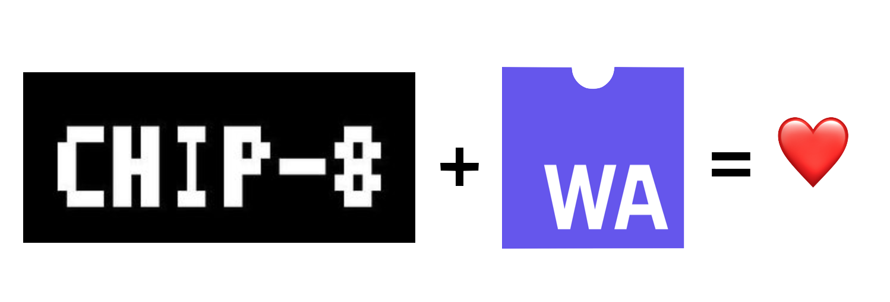

Tired of slow interpretation of your CHIP-8 roms? Ever wanted to play in CHIP-8 games at the **FULL SPEED**?

Enter

# Emchipten

Emchipten is a binary compiler. It lets you to compile your CHIP-8 roms into binary format of the future: [WebAssembly](http://webassembly.org/).

Try it in action: https://pepyakin.github.io/emchipten/

## Are you serious?

No actually. This is a toy project I developed while worked on my [binaryen bindings for Rust](https://github.com/pepyakin/binaryen-rs).
